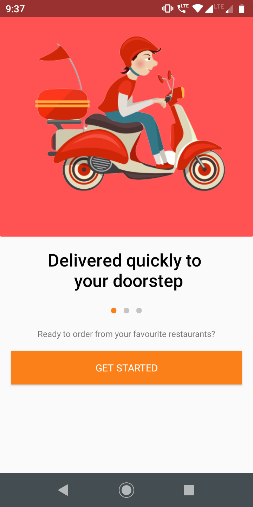
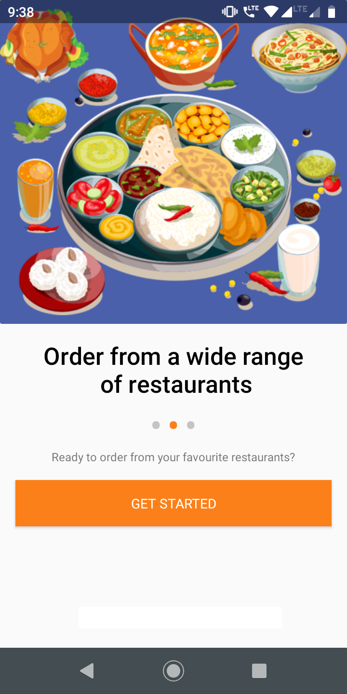

# IntroScreen
###### swiggy like intro screen 

#### Developed with ❤️ by FoodBee
#### Support by clicking the ⭐ button on the upper right of this page. ✌️

## Setup

Follow the [Installation Instructions](#installation) to set it up.

#### Screenshots

<table>
   <tr>
     <td><kbd></kbd></td>
     <td><kbd></kbd></td>
     <td><kbd></kbd></td>
    </tr>
</table>

## Installation

Add Jitpack repository in your root `build.gradle` file:

```groovy
allprojects {
  repositories {
    maven { url 'https://jitpack.io' }
  }
}
```

add the dependency to your app:

```groovy
dependencies {
  implementation 'com.github.foodbee:IntroScreen:(latest-version)'
}
```
[](https://jitpack.io/#foodbee/IntroScreen)

And then in your intro screen activity add it like this

```kotlin
import `in`.foodbee.intro_screen.IntroActivity
import android.os.Bundle
import androidx.core.content.ContextCompat

// your activity should extend IntroActivity and should not have any setContentView method just like below
class MainActivity : IntroActivity() {

  override fun onCreate(savedInstanceState: Bundle?) {
    super.onCreate(savedInstanceState)

    // add your resources in strings
    val titleArray = arrayOf(
        getString(R.string.slide_1_title), 
        getString(R.string.slide_2_title),
        getString(R.string.slide_3_title)
    )

    // add your images in drawable
    val imageArray = arrayOf(
        getDrawable(R.drawable.slide_1_image),
        getDrawable(R.drawable.slide_2_image),
        getDrawable(R.drawable.slide_3_image)
    )
      
    // add dot inactive and active screen colors
    val dotInActiveColor = ContextCompat.getColor(this, R.color.dot_inactive)
    val dotActiveColor = ContextCompat.getColor(this, R.color.colorAccent)

    // subtitle text is common to all screens
    val subtitleText = getString(R.string.ready_to_order_from_your_favourite_restaurants)

    // call this method and see the magic in your app, it calls my code and displays the slider
    initSlide(titleArray, imageArray, subtitleText, dotInActiveColor, dotActiveColor)


    binding.getStartedBtn.setOnClickListener {
       //implement the getstarted button click action here
    }
  }

}
```

Design credits: Swiggy 
Assets source: Internet 


